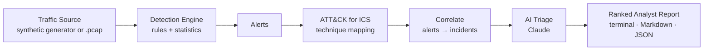

# ICS Sentinel

**An AI SOC analyst for industrial networks: detects attacks on Modbus TCP control traffic, then uses Claude to triage every alert into plain English, MITRE ATT&CK for ICS context, and concrete response actions.**

> 📸 *Maintainer note: record a ~60s GIF of `make demo` and add 1–2 screenshots — see [`demo/README.md`](demo/README.md) for exactly what to capture.*

## Why it matters

Operational Technology — the PLCs, RTUs, and SCADA systems that run power
grids, water treatment, and manufacturing — was built for reliability, not
security, and is increasingly targeted (Industroyer, TRITON, the Oldsmar
water incident). Modbus, one of the most common OT protocols, has **no
authentication or encryption**: any device on the network can issue commands
to a PLC. Meanwhile, OT analysts face severe alert fatigue and a shortage of
staff who understand both the protocols and the threat landscape.

ICS Sentinel demonstrates both halves of the answer: detection of
OT-specific attacks, and AI that compresses the triage work that normally
requires a scarce specialist.

## Architecture



## Quickstart

Requires Python 3.11+. The pipeline runs with **zero dependencies** — no ICS
hardware, no pcaps. Installing the package adds the `rich` report and real
AI triage:

```bash
git clone <this-repo> && cd OT-AI
python -m ics_sentinel.demo          # full pipeline, works immediately

# Optional, for the pretty report + AI triage + tests:
pip install -e ".[dev]"
cp .env.example .env                 # add your ANTHROPIC_API_KEY
make demo                            # traffic -> detect -> ATT&CK -> triage -> report
make demo-benign                     # clean baseline: proves zero false positives
make test                            # 75 pytest tests
```

Without `ANTHROPIC_API_KEY` the demo still runs end-to-end using clearly
labeled **`[MOCK]`** deterministic triage; with a key, triage is performed by
Claude (`claude-opus-4-8`, override via `ICS_SENTINEL_MODEL`) and labeled
**`[AI]`**.

### Flags

| Flag | Effect |
|---|---|
| `--scenario NAME` | Inject one attack scenario (repeatable; default = all). |
| `--benign` | Clean baseline, no attacks — proves zero false positives. |
| `--baseline` | Learn scan/flood thresholds from a clean sample instead of static config. |
| `--pcap FILE` | Analyze a real Modbus TCP capture instead of synthetic traffic (needs `scapy`: `pip install 'ics-sentinel[pcap]'`). |
| `--output PATH` | Also write the report to `.md` or `.json` (SIEM-shaped). |
| `--plain` | Force the plain-text report (no `rich` panels). |
| `--show-traffic` | Print the raw frame stream before the report. |
| `--duration` / `--seed` | Length of the simulated window / RNG seed. |

## Threat model

**Assets protected:** two PLCs running a simulated water-treatment skid
(tank level, pump setpoint, pump run coil), commanded only by an engineering
workstation and polled by an HMI — all speaking unauthenticated Modbus TCP.

**Attacker assumption:** a foothold on the OT network segment (compromised
host `10.0.0.66`, or the engineering workstation itself), able to send
arbitrary Modbus frames.

| Attack scenario | Wire behavior | Detection rule | ATT&CK for ICS |
|---|---|---|---|
| `unauthorized_write` | Normal-looking commands, wrong source | R1 write-source allowlist | T0855 Unauthorized Command Message |
| `dangerous_setpoint` | 200% setpoint from the *authorized* EWS | R2 safe-range check | T0836 Modify Parameter, T0831 Manipulation of Control |
| `recon_scan` | 160 register/unit probes in ~4s | R3 distinct-points window | T0846 Remote System Discovery |
| `malformed_frame` | Illegal function codes, corrupt PDU | R4 structural validation | T0814 Denial of Service |
| `replay_flood` | Identical command 40×/s (byte-identical replay) | R5 statistical write-rate baseline | T0814 Denial of Service, T0855 |
| `response_spoof` | Frozen tank-level injected over real polls (Stuxnet-style) | R6 conflicting-duplicate response | T0856 Spoof Reporting Message |

Detection never reads the generator's ground-truth labels — alerts are earned
from the traffic, and a test proves relabeling frames changes nothing.
Related alerts are then **correlated by source into incidents** (one actor's
scan→write→flood is one incident, not ten tickets), which is the unit the AI
triages — fewer, richer LLM calls.

## Sample output

Real run of `python -m ics_sentinel.demo` (mock mode, plain renderer; the
`rich` version draws the same content in colored severity-ranked panels):

```
[1/5] Generated 60s of Modbus TCP traffic with scenarios: unauthorized_write, dangerous_setpoint, recon_scan, malformed_frame, replay_flood, response_spoof
      396 frames — 349 reads / 45 writes / 2 illegal — sources: 10.0.0.66 (205), 10.0.0.10 (189), 10.0.0.11 (2)
[2/5] Detection engine raised 11 alert(s)
[3/5] Mapped to MITRE ATT&CK for ICS: T0814, T0831, T0836, T0846, T0855, T0856
[4/5] Correlated into 3 incident(s) (11 alerts → 3 triage calls)
[5/5] Triage mode: MOCK  (set ANTHROPIC_API_KEY for AI triage)

EXECUTIVE SUMMARY
3 incident(s) (1 Critical, 2 High) comprising 11 alert(s), from 10.0.0.10,
10.0.0.11, 10.0.0.66. Activity from 10.0.0.66 forms a coherent intrusion:
reconnaissance and/or direct process commands from a host with no business
issuing them. Recommended priority: isolate 10.0.0.66, verify PLC state, then
investigate any anomalies from authorized hosts.

------------------------------------------------------------------------------
[CRITICAL] INC-02 — actor 10.0.0.11, 1 alert(s) [MOCK]
  Window:     2026-01-05 08:00:18 UTC -> 08:00:18
  Alert:      ALT-003 08:00:18 Process safety violation — Write Single Register
              → 10.0.0.21 [unit 2] addr 40002 values [200] [T0836, T0831]
              Write of 200 to register 40002 on 10.0.0.21 [unit 2] is outside
              the safe operating range 20–90.
  Severity:   Critical
  Operator:   A command set Write Single Register at 10.0.0.21 to 200, far
              outside the safe operating range. If the controller obeys it,
              the tank can overflow or the pump can be damaged.
  Action 1:   Immediately verify the current setpoint on the PLC and restore a
              safe value via local HMI
  Action 2:   Isolate or quarantine the source workstation 10.0.0.11 pending
              forensic review
  ...
```

The full mock-mode run is saved at [`demo/sample-report.md`](demo/sample-report.md).

## The simulated plant

- **HMI master** `10.0.0.10` polls two PLCs every 2 s and never writes
- **Engineering workstation** `10.0.0.11` — the *only* authorized write source
- **PLC-1 intake** `10.0.0.20` (unit 1), **PLC-2 storage** `10.0.0.21` (unit 2):
  register `40001` = tank level (0–100%), register `40002` = pump setpoint,
  coil `0` = pump on/off

Tank levels evolve under simple pump physics with hysteresis control, so
polled values are coherent over time — a meaningful baseline for the
detections to defend. All topology, register maps, safe ranges, and
detection thresholds live in [`ics_sentinel/config.py`](ics_sentinel/config.py).

## Project status

| Phase | Deliverable | Status |
|-------|-------------|--------|
| 1 | Modbus TCP frame model + synthetic benign traffic generator | ✅ |
| 2 | Injectable attack scenarios | ✅ |
| 3 | Detection engine (rules + statistical baselines) | ✅ |
| 4 | MITRE ATT&CK for ICS mapping | ✅ |
| 5 | AI triage layer (Claude, with mock fallback) | ✅ |
| 6 | Ranked incident report + one-command demo | ✅ |
| v1.1 | T0856 spoof rule, learned baselines, incident correlation, structured-output triage, real `.pcap` ingestion, MD/JSON export | ✅ |

## Scope & limitations / what I'd build next

This is deliberately a weekend-sized build. Honest boundaries:

- **Modbus TCP only.** DNP3, S7comm, and OPC-UA are future work; the frame
  model was designed so a new protocol slots in behind the same detections.
- **Synthetic traffic is the primary source**, but real `.pcap` captures work
  too (`--pcap`, via the optional `scapy` extra) — they populate the same
  `ModbusFrame` objects, so the whole pipeline is source-agnostic.
- **Statistical baselines, not trained ML.** The frequency rule uses a
  leave-one-out mean+3σ bound; `--baseline` additionally learns thresholds
  from a clean capture. A trained-model detector is still future work.
- **Attack frames don't feed back into the physics.** Detection works on
  traffic, not consequences. The T0856 spoof rule catches *injected*
  conflicting responses on the wire, but a controller acting on a stealthily
  manipulated value (with no wire conflict) would need a process-model check.
- **In-memory, single-shot analysis.** No streaming daemon, no database, no
  alert state across runs — right-sized for a demo, wrong-sized for a plant.
- **Correlation is by source IP.** Good enough to group one actor's campaign;
  multi-host coordinated attacks would need a richer correlation model.

See [`DESIGN.md`](DESIGN.md) for why each detection exists and why it maps to
its ATT&CK technique.

## License

MIT — see [`LICENSE`](LICENSE).
